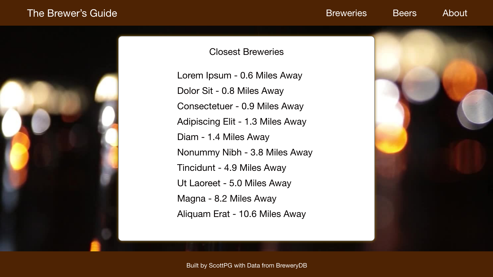
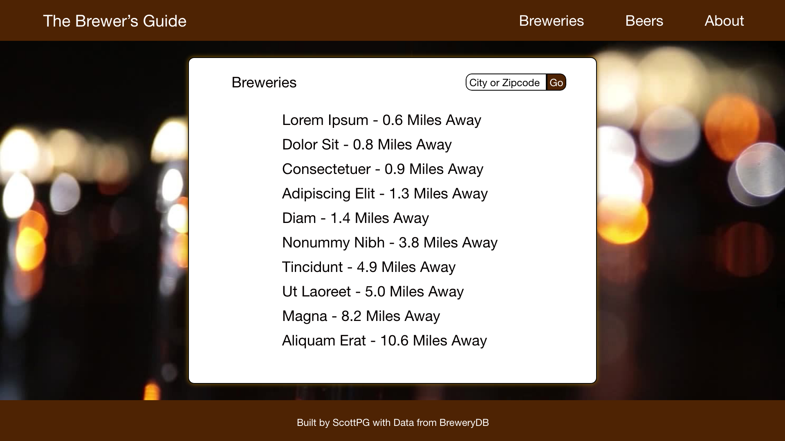
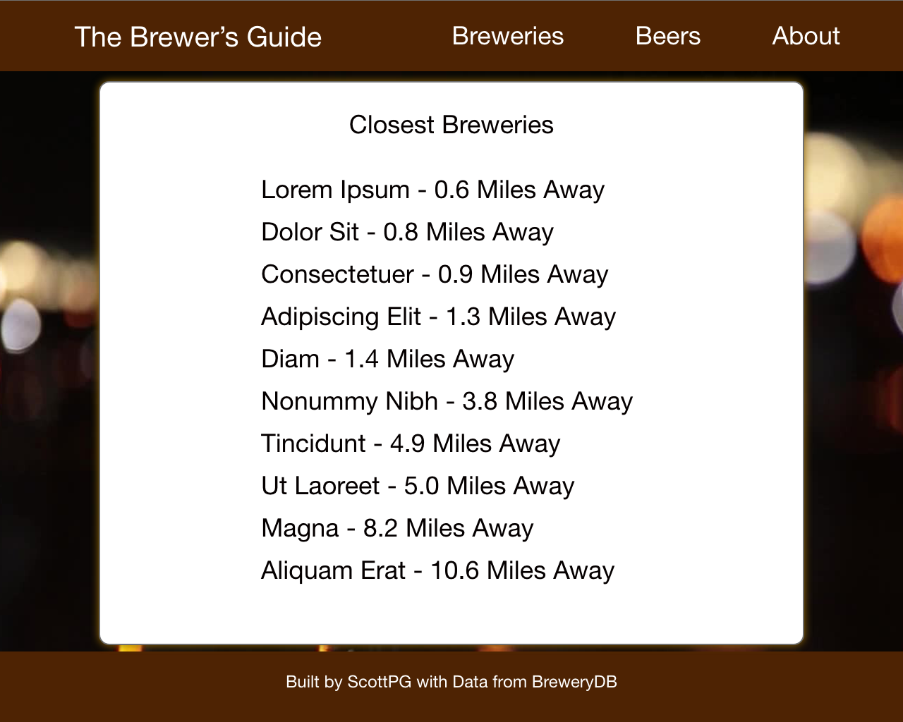

# **"The Brewer's Guide"** by Scott Griffith
 

## The App

This app will be called The Brewer's Guide as an homage to my favorite bar in the world, "The Brewer's Art."

I like craft beer.  I want to create a website that makes finding craft beer and craft breweries easier.  To that end, I'm using BreweryDB to render and supply data.  While building the project, I will be using the sandbox mode, but after the project is built, I will put down $20 to access all of the data, unless I can find a free API with this feature set. (So far, my search has found one with a reduced feature set for breweries only.  I like that BreweryDB has crossover between beers and breweries)

## Wireframes:
### Desktop and Landscape Tablet Wireframe:  

### Portrait Tablet Wireframe:

### Phone Wireframe:

## Component Hierarchy:
- App.jsx
- - BreweryList
- - - Brewery
- - BeerList 
- - - Beer
- - About

## APIs
- Paid Beer and Brewery: https://www.brewerydb.com/developers (Beer access in free is huge! Brewery access is limited.)
- Free Brewery: https://www.openbrewerydb.org/

## MVP
- Reliably pull from APIs and present concise and clear information. Minimize API calls as much as possible
- Be dynamically resizable
- List breweries
- Search breweries
- List beers
- Search beers
- Link to my GitHub to make my good work clear
- Integrate storybook to make prettier, more consistent components

## Post-MVP, Proposed
- Use geolocation to list breweries by distance
- Export a to-try list as a document

## Post-MVP, Actual
- TBD

## SWOT Analysis
I'm pretty confident that I can pull this off from a programming standpoint.  I'm getting React, and I'm getting API access.  My weakness is going to be styling, so I'm going to try to get through the programming as quickly as possible to devote time to Storybook and Responsive CSS.  I think my biggest opportunity is to make something I am proud of.